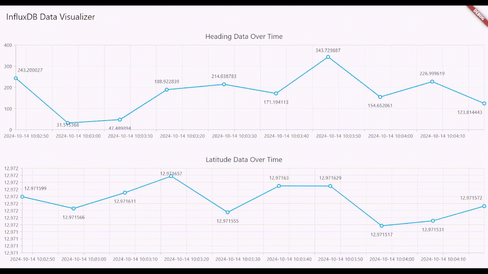

# InfluxDB to Flutter 
Retrieve data from **Linux InfluxDB** to **Windows Flutter** Dashboard App using flux query.

## Table of Contents
- [Features](#features)
- [Prequisites](#prequisites)
- [Installation](#installation)
- [Usage](#usage)
- [Project Structure](#project-structure)
- [Contributing](#contributing)
- [License](#license)

## Features
- **Real-Time Data Visualization**: Dashboard updates in real time, as shown below.

    

- **Data Hover**: Hovering over each data point displays its exact value and timestamp for easy analysis.

    

## Prequisites
This project uses the following tools and versions:
1. VM Ubuntu 20.04:
    - InfluxDB v2-2.7.10
    - ROS: Noetic
    - ROSBridge WebSocket: ROS Noetic 1.17.0
    - Python 3.8 (for ROS tools and scripts)

2. Windows 10 x64:
    - Flutter 3.24.3
    - Dart 3.5.3

## Installation
1. **InfluxDB v2**
   - Follow the [Official Linux InfluxDB v2 Installation Guide](https://docs.influxdata.com/influxdb/v2/install/?t=Linux) for the latest instructions on setting up InfluxDB v2 + InfluxDB v2 CLI, including configurations for your operating system.

2. **ROS Noetic**
    - Follow the [Official Linux Ubuntu ROS Noetic Installation Guide](http://wiki.ros.org/noetic/Installation/Ubuntu) for the latest instructions.

    - Or use the following steps:
    ```
    sudo sh -c 'echo "deb http://packages.ros.org/ros/ubuntu $(lsb_release -sc) main" > /etc/apt/sources.list.d/ros-latest.list'
    sudo apt install curl
    curl -s https://raw.githubusercontent.com/ros/rosdistro/master/ros.asc | sudo apt-key add -
    sudo apt update
    sudo apt install ros-noetic-desktop-full
    sudo rosdep init
    rosdep update
    echo "source /opt/ros/noetic/setup.bash" >> ~/.bashrc
    source ~/.bashrc
    sudo apt install python3-rosinstall python3-rosinstall-generator python3-wstool build-essential
    ```

3. **ROSBridge WebSocket for ROS Noetic**
    - Install ROSBridge Server:
    ```
    sudo apt install ros-noetic-rosbridge-server
    ```

    - Launch rosbridge_server
    ```
    roslaunch rosbridge_server rosbridge_websocket.launch
    ```

## Usage


## Project Structure


## Contributing


## License
See License in [LICENSE](LICENSE)