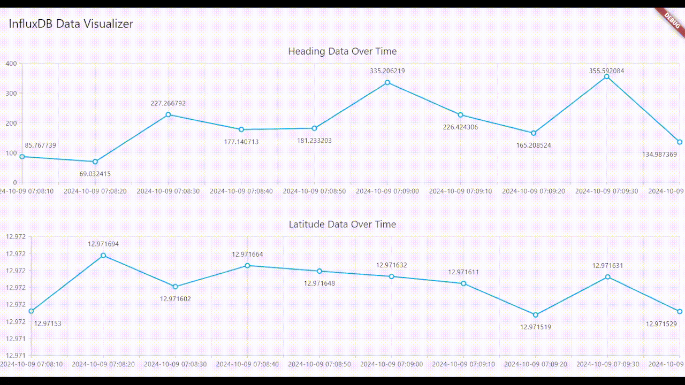

# InfluxDB to Flutter 
Retrieve data from **Linux InfluxDB** to **Windows Flutter** Dashboard App using flux query.

## Table of Contents
- [Features](#features)
- [Prequisites](#prequisites)
- [Installation](#installation)
- [Usage](#usage)
- [Contributing](#contributing)
- [License](#license)

## Features
- **Real-Time Data Visualization**: Dashboard updates in real time, as shown below.

    

- **Data Hover**: Hovering over each data point displays its exact value and timestamp for easy analysis.

    

## Prequisites
This project uses the following tools and versions:
1. VM Ubuntu 20.04:
    - InfluxDB v2-2.7.10
    - ROS: Noetic
    - ROSBridge WebSocket: ROS Noetic 1.17.0
    - Python 3.8 (for ROS tools and scripts)

2. Windows 10 x64:
    - Flutter 3.24.3
    - Dart 3.5.3

3. Flutter Dependencies:
    - influxdb_client: ^2.2.0
    - syncfusion_flutter_charts: ^27.1.51
    - intl: ^0.18.1
    - flutter_dotenv : ^5.2.1

## Installation
1. **InfluxDB v2**
   - Follow the [Official Linux InfluxDB v2 Installation Guide](https://docs.influxdata.com/influxdb/v2/install/?t=Linux) for the latest instructions on setting up InfluxDB v2 + InfluxDB v2 CLI, including configurations for your operating system.

2. **ROS Noetic**
    - Follow the [Official Linux Ubuntu ROS Noetic Installation Guide](http://wiki.ros.org/noetic/Installation/Ubuntu) for the latest instructions.

    - Or use the following steps:
        ```
        sudo sh -c 'echo "deb http://packages.ros.org/ros/ubuntu $(lsb_release -sc) main" > /etc/apt/sources.list.d/ros-latest.list'
        sudo apt install curl
        curl -s https://raw.githubusercontent.com/ros/rosdistro/master/ros.asc | sudo apt-key add -
        sudo apt update
        sudo apt install ros-noetic-desktop-full
        sudo rosdep init
        rosdep update
        echo "source /opt/ros/noetic/setup.bash" >> ~/.bashrc
        source ~/.bashrc
        sudo apt install python3-rosinstall python3-rosinstall-generator python3-wstool build-essential
        ```

3. **ROS Package**
    - Follow the [Official Instructions for creating a workspace for catkin](http://wiki.ros.org/catkin/Tutorials/create_a_workspace) and select the noetic distro. There are series of tutorials of it, and please finish it until where it is explaining to build and using catkin packages in a workspace.

4. **ROSBridge WebSocket for ROS Noetic**
    - Install ROSBridge Server:
        ```
        sudo apt install ros-noetic-rosbridge-server
        ```

    - Launch rosbridge_server
        ```
        roslaunch rosbridge_server rosbridge_websocket.launch
        ```

## Usage
- After Installation done in both host OS and VM OS, subscribe to ros topic from sensors.

- If you dont have the ros publisher and subscriber yet, make a dummy talker for publishing sensor data (**If you already have ros topic publisher from sensors, you can skip this.**) and a dummy listener for subscribing and send the data to InfluxDB.

    1. Make a Dummy Talker script with Python (customize based on your sensors), check ros_scripts folder -> ros_talker.py

    2. Make a Dummy Listener script with Python (customize based on your sensors), check ros_scripts folder -> ros_listener.py

- Both Scripts are based on the [Writing Simple Publisher and Subscriber (Python) Tutorials.](http://wiki.ros.org/ROS/Tutorials/WritingPublisherSubscriber%28python%29)

- Listener Script is already customized to write data using InfluxDB Write API, for further information you can access the [influxdb_client python documentation.](https://github.com/influxdata/influxdb-client-python)

- You can check from your terminal to see whether your scripts are working or not (using rospy.loginfo in the scripts).

    3. Access your InfluxDB via localhost:8086 -> Data Explorer. Try to visualize dummy data using graph.

    4. After done with storing data into InfluxDB, configure your Flutter Project (use dotenv to configure credential variables).

    5. Run the App. 

## License
See License in [LICENSE](LICENSE)